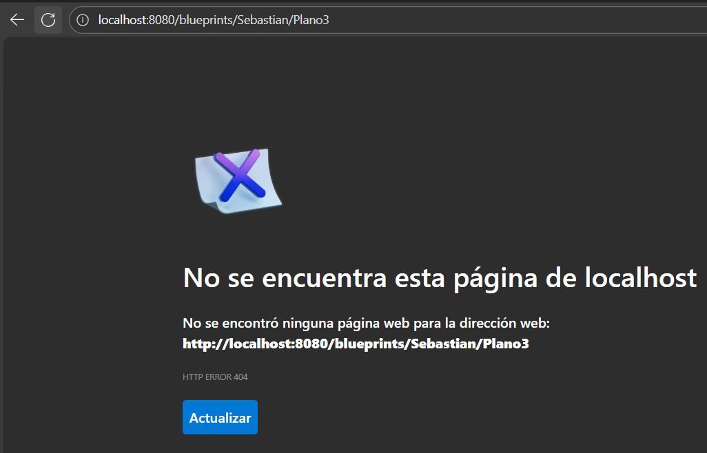

# Laboratorio 4: API REST para la gestión de planos.

## Autor: Sebastian Galvis Briceño

En este ejercicio se va a construír el componente BlueprintsRESTAPI, el cual permita gestionar los planos arquitectónicos de una prestigiosa compañia de diseño. La idea de este API es ofrecer un medio estandarizado e 'independiente de la plataforma' para que las herramientas que se desarrollen a futuro para la compañía puedan gestionar los planos de forma centralizada. El siguiente, es el diagrama de componentes que corresponde a las decisiones arquitectónicas planteadas al inicio del proyecto:


Donde se definió que:
* El componente BlueprintsRESTAPI debe resolver los servicios de su interfaz a través de un componente de servicios, el cual -a su vez- estará asociado con un componente que provea el esquema de persistencia. Es decir, se quiere un bajo acoplamiento entre el API, la implementación de los servicios, y el esquema de persistencia usado por los mismos.

Del anterior diagrama de componentes (de alto nivel), se desprendió el siguiente diseño detallado, cuando se decidió que el API estará implementado usando el esquema de inyección de dependencias de Spring (el cual requiere aplicar el principio de Inversión de Dependencias), la extensión SpringMVC para definir los servicios REST, y SpringBoot para la configurar la aplicación:


## Parte 1: 
1. Integre al proyecto base suministrado los Beans desarrollados en el ejercicio anterior. Sólo copie las clases, NO los archivos de configuración. Rectifique que se tenga correctamente configurado el esquema de inyección de dependencias con las anotaciones *@Service* y *@Autowired*.


2. Modifique el bean de persistecia 'InMemoryBlueprintPersistence' para que por defecto se inicialice con al menos otros tres planos, y con dos asociados a un mismo autor.

    **Desarrollo:** Para llevar a cabo lo solicitado, solo debemos agregar las siguientes líneas en el método ***InMemoryBlueprintPersistence()*** de la clase ***InMemoryBlueprintPersistence***:
   ``` java
    Point[] pts2 = new Point[]{new Point(10, 10), new Point(20, 20), new Point(30, 30)};
    Blueprint bp2 = new Blueprint("Sebastian", "Plano1", pts2);
    blueprints.put(new Tuple<>(bp2.getAuthor(), bp2.getName()), bp2);

    Point[] pts3 = new Point[]{new Point(5, 5), new Point(15, 15)};
    Blueprint bp3 = new Blueprint("Sebastian", "Plano2", pts3);
    blueprints.put(new Tuple<>(bp3.getAuthor(), bp3.getName()), bp3);

    Point[] pts4 = new Point[]{new Point(100, 50), new Point(120, 80), new Point(140, 100)};
    Blueprint bp4 = new Blueprint("Vegueta", "Plano3", pts4);
    blueprints.put(new Tuple<>(bp4.getAuthor(), bp4.getName()), bp4);
   ```

3. Configure su aplicación para que ofrezca el recurso "/blueprints", de manera que cuando se le haga una petición GET, retorne -en formato jSON- el conjunto de todos los planos. Para esto:
   
   **Desarrollo:** Se ha realizado la siguiente implementación en el paquete *controllers* de la clase ***BlueprintAPIController***:
   ``` java
   @RestController
   @RequestMapping("/blueprints")
   public class BlueprintAPIController {
   
       @Autowired
       private BlueprintsServices blueprintsServices;
   
       @GetMapping
       public ResponseEntity<Set<Blueprint>> getAllBlueprints() {
           try {
               Set<Blueprint> allBlueprints = blueprintsServices.getAllBlueprints();
               return ResponseEntity.ok(allBlueprints);
           } catch (Exception e) {
               return ResponseEntity.internalServerError().build();
           }
       }
   }
   ```
   Sin embargo, la aplicación seguirá corriendo normal sin permitir realizar esta petición, debido a que está usando un ***AnnotationConfigApplicationContext*** manual en ***MainApp***, que crea el contexto, ejecuta unos *System.out.println* y luego cierra todo
   
   Para solucionarlo, será necesario comentar la clase ***MainApp*** y crear la siguiente:
   ```java
   package edu.eci.arsw.blueprints;
   
   import org.springframework.boot.SpringApplication;
   import org.springframework.boot.autoconfigure.SpringBootApplication;
   import org.springframework.context.annotation.ComponentScan;
   
   @SpringBootApplication
   @ComponentScan(basePackages = {"edu.eci.arsw.blueprints"})
   public class BlueprintsAPIApplication {
       public static void main(String[] args) {
           SpringApplication.run(BlueprintsAPIApplication.class, args);
       }
   }
   ```
   Ahora si podremos acceder desde el navegador a ***http://localhost:8080/blueprints*** y ver lo siguiente:
   

4.  Verifique el funcionamiento de a aplicación lanzando la aplicación con maven:
   ```
   mvn compile
   mvn spring-boot:run
   ```
   Y luego enviando una petición GET a: http://localhost:8080/blueprints. Rectifique que, como respuesta, se obtenga un objeto jSON con una lista que contenga el detalle de los planos suministados por defecto, y que se haya aplicado el filtrado de puntos correspondiente.
   
   **Desarrollo:** La solución de este punto se realizó en el inciso anterior, al darnos cuenta de que no servía de nada implementar el controller hasta ese momento.

5. Modifique el controlador para que ahora, acepte peticiones GET al recurso /blueprints/{author}, el cual retorne usando una representación jSON todos los planos realizados por el autor cuyo nombre sea {author}. Si no existe dicho autor, se debe responder con el código de error HTTP 404. Para esto, revise en la documentación de Spring, sección 22.3.2, el uso de @PathVariable. De nuevo, verifique que al hacer una petición GET -por ejemplo- a recurso http://localhost:8080/blueprints/juan, se obtenga en formato jSON el conjunto de planos asociados al autor 'juan' (ajuste esto a los nombres de autor usados en el punto 2).
   
   **Desarrollo:** En este caso usaremos ***@PathVariable*** para capturar el valor dinámico *{author}* y devolver los planos asociados a ese autor.
   
   Así, solamente tendremos que implementar el siguiente endpoint en ***BlueprintAPIController***:
   ``` java
    @GetMapping("/{author}")
    public ResponseEntity<Set<Blueprint>> getBlueprintsByAuthor(@PathVariable("author") String author) {
        try {
            Set<Blueprint> blueprints = blueprintsServices.getBlueprintsByAuthor(author);
            if (blueprints == null || blueprints.isEmpty()) {
                return ResponseEntity.notFound().build();
            }
            return ResponseEntity.ok(blueprints);
        } catch (BlueprintNotFoundException e) {
            return ResponseEntity.notFound().build();
        } catch (Exception e) {
            return ResponseEntity.internalServerError().build();
        }
    }
   ```
   **Resultado:**
   
   
   
6. Modifique el controlador para que ahora, acepte peticiones GET al recurso /blueprints/{author}/{bpname}, el cual retorne usando una representación jSON sólo UN plano, en este caso el realizado por {author} y cuyo nombre sea {bpname}. De nuevo, si no existe dicho autor, se debe responder con el código de error HTTP 404.

   **Desarrollo:** De nuevo, únicamente tenemos que implementar el siguiente endpoint:
   ``` java
    @GetMapping("/{author}/{bpname}")
    public ResponseEntity<Blueprint> getBlueprintByAuthorAndName(@PathVariable("author") String author,
                                                                 @PathVariable("bpname") String bpname) {
        try {
            Blueprint blueprint = blueprintsServices.getBlueprint(author, bpname);
            if (blueprint == null) {
                return ResponseEntity.notFound().build();
            }
            return ResponseEntity.ok(blueprint);
        } catch (BlueprintNotFoundException e) {
            return ResponseEntity.notFound().build();
        } catch (Exception e) {
            return ResponseEntity.internalServerError().build();
        }
    }
   ```
   **Resultado:**
   
   


## Parte 2:
1. Agregue el manejo de peticiones POST (creación de nuevos planos), de manera que un cliente http pueda registrar una nueva orden haciendo una petición POST al recurso ‘planos’, y enviando como contenido de la petición todo el detalle de dicho recurso a través de un documento jSON. Para esto, tenga en cuenta el siguiente ejemplo, que considera -por consistencia con el protocolo HTTP- el manejo de códigos de estados HTTP (en caso de éxito o error):
   
   **Desarrollo:** Será necesario implementar el endpoint:
   ``` java
    @PostMapping
    public ResponseEntity<?> createBlueprint(@RequestBody Blueprint blueprint) {
        try {
            blueprintsServices.addNewBlueprint(blueprint);
            return ResponseEntity.status(HttpStatus.CREATED).body(blueprint);
        } catch (BlueprintPersistenceException e) {
            return ResponseEntity.status(HttpStatus.CONFLICT).body(e.getMessage());
        } catch (Exception e) {
            return ResponseEntity.status(HttpStatus.INTERNAL_SERVER_ERROR).body("Error al crear el plano");
        }
    }
   ```
   Para ponerlo a prueba, solo debemos de realizar la siguiente petición mediante postman:
   
   

2. Para probar que el recurso ‘planos’ acepta e interpreta correctamente las peticiones POST, use el comando curl de Unix. Este comando tiene como parámetro el tipo de contenido manejado (en este caso jSON), y el ‘cuerpo del mensaje’ que irá con la petición, lo cual en este caso debe ser un documento jSON equivalente a la clase Cliente (donde en lugar de {ObjetoJSON}, se usará un objeto jSON correspondiente a una nueva orden:
   ``` bash
   $ curl -i -X POST -HContent-Type:application/json -HAccept:application/json http://URL_del_recurso_ordenes -d '{ObjetoJSON}'
   ```
   Con lo anterior, registre un nuevo plano:

   Nota: puede basarse en el formato jSON mostrado en el navegador al consultar una orden con el método GET
   
   **Desarrollo:** Haremos la prueba con el siguiente comando:

   Como vamos a usar powershell (Debido a que estamos en windows) será necesario usar Invoke-WebRequest y seguir el formato de powershell:
   ``` powershell
   Invoke-WebRequest -Uri "http://localhost:8080/blueprints" `
     -Method POST `
     -ContentType "application/json" `
     -Body '{
       "author": "Sebastian",
       "name": "PlanoNuevo2",
       "points": [
         {"x": 10, "y": 20},
         {"x": 30, "y": 40}
       ]
     }'
   ```
   **Resultado:** 
   Como podemos ver, se creó exitosamente:
   
   

3. Teniendo en cuenta el autor y numbre del plano registrado, verifique que el mismo se pueda obtener mediante una petición GET al recurso '/blueprints/{author}/{bpname}' correspondiente.
   
   **Resultado:** Ya se ha verificado en cada oportunidad.

4. Agregue soporte al verbo PUT para los recursos de la forma '/blueprints/{author}/{bpname}', de manera que sea posible actualizar un plano determinado.

   **Desarrollo:** De nuevo, implementamos el siguiente método:
   ``` java
    @PutMapping("/{author}/{bpname}")
    public ResponseEntity<?> updateBlueprint(
            @PathVariable String author,
            @PathVariable String bpname,
            @RequestBody Blueprint updatedBlueprint) {
        try {
            blueprintsServices.updateBlueprint(author, bpname, updatedBlueprint);
            return ResponseEntity.ok("Blueprint updated successfully");
        } catch (BlueprintNotFoundException e) {
            return ResponseEntity.status(404).body("Blueprint not found: " + e.getMessage());
        } catch (Exception e) {
            return ResponseEntity.status(500).body("Error updating blueprint: " + e.getMessage());
        }
    }
   ```
   Para probarlo, podemos usar:
   ``` ps
   Invoke-WebRequest -Uri "http://localhost:8080/blueprints/Sebastian/PlanoNuevo" `
     -Method PUT `
     -ContentType "application/json" `
     -Body '{
       "author": "Sebastian",
       "name": "PlanoNuevo",
       "points": [
         {"x": 50, "y": 60},
         {"x": 70, "y": 80}
       ]
     }'
   ```
   **Resultado:**
   
   


## Parte 3: 
El componente BlueprintsRESTAPI funcionará en un entorno concurrente. Es decir, atederá múltiples peticiones simultáneamente (con el stack de aplicaciones usado, dichas peticiones se atenderán por defecto a través múltiples de hilos). Dado lo anterior, debe hacer una revisión de su API (una vez funcione), e identificar:
* Qué condiciones de carrera se podrían presentar? 
* Cuales son las respectivas regiones críticas?

**Respuesta:**
* Condiciones de carrera posibles:
1. Inserción concurrente de blueprints: Si dos clientes realizan un POST para crear planos con el mismo autor y nombre al mismo tiempo, puede que se sobrescriban o se guarde un estado inconsistente.
2. Actualización concurrente (PUT): Varias peticiones PUT al mismo blueprint podrían hacer que una actualización invalide o reemplace cambios hechos por otra, perdiendo información.
3. Eliminación y consulta simultánea: Si se implementa eliminación en el futuro, podría ocurrir que un hilo elimine un plano mientras otro lo consulta o actualiza, provocando errores de consistencia.
4. Acceso concurrente a la colección de datos compartida: Dado que la persistencia en memoria (como un HashMap o similar) no es sincronizada, múltiples escrituras y lecturas simultáneas podrían producir estados corruptos o lecturas inconsistentes.
* Regiones críticas:
1. Métodos que escriben o modifican el almacenamiento de blueprints
   - addNewBlueprint(Blueprint bp)
   - updateBlueprint(author, bpname, Blueprint bp)
2. Colección de almacenamiento compartido
   - El Map<String,Blueprint> o la estructura que actúe como repositorio de planos.
3. Operaciones de lectura que dependen de la consistencia del estado
   - getBlueprint(author, bpname)
   - getAllBlueprints()


Ajuste el código para suprimir las condiciones de carrera. Tengan en cuenta que simplemente sincronizar el acceso a las operaciones de persistencia/consulta DEGRADARÁ SIGNIFICATIVAMENTE el desempeño de API, por lo cual se deben buscar estrategias alternativas.

Escriba su análisis y la solución aplicada en el archivo ANALISIS_CONCURRENCIA.txt


